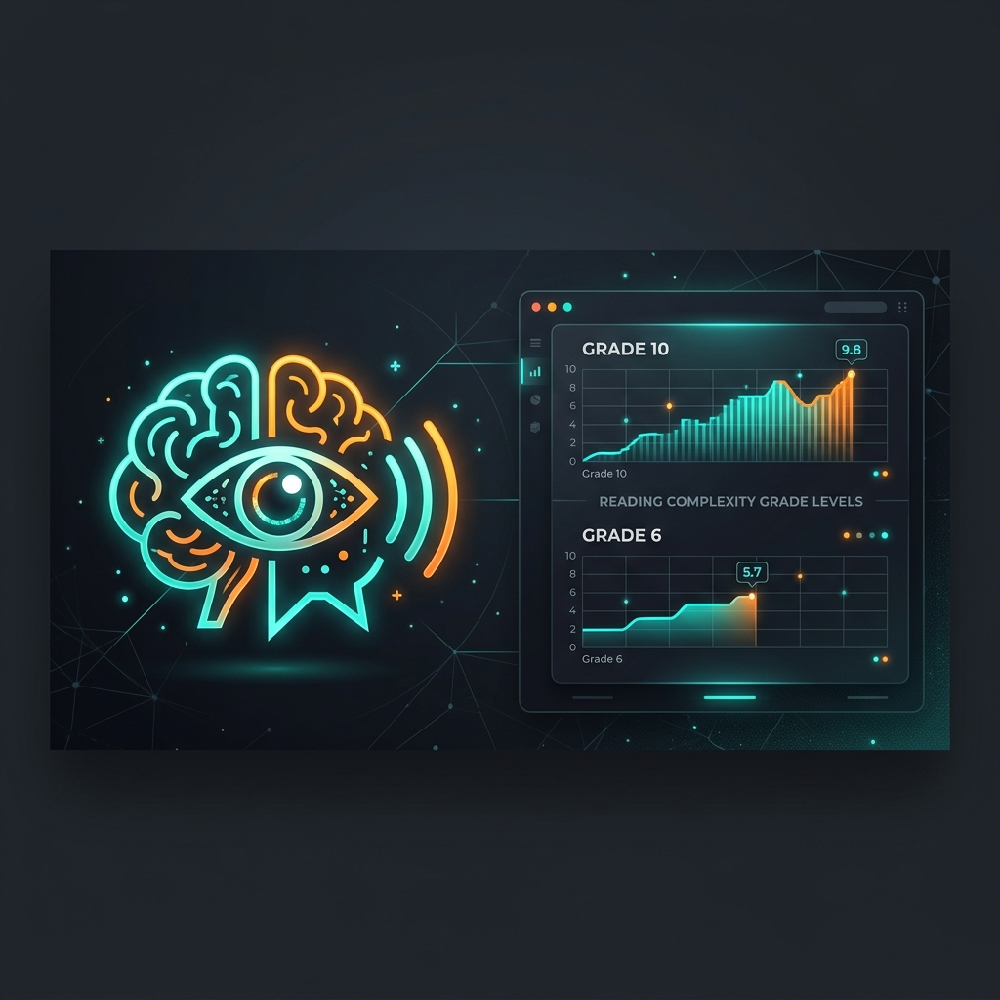
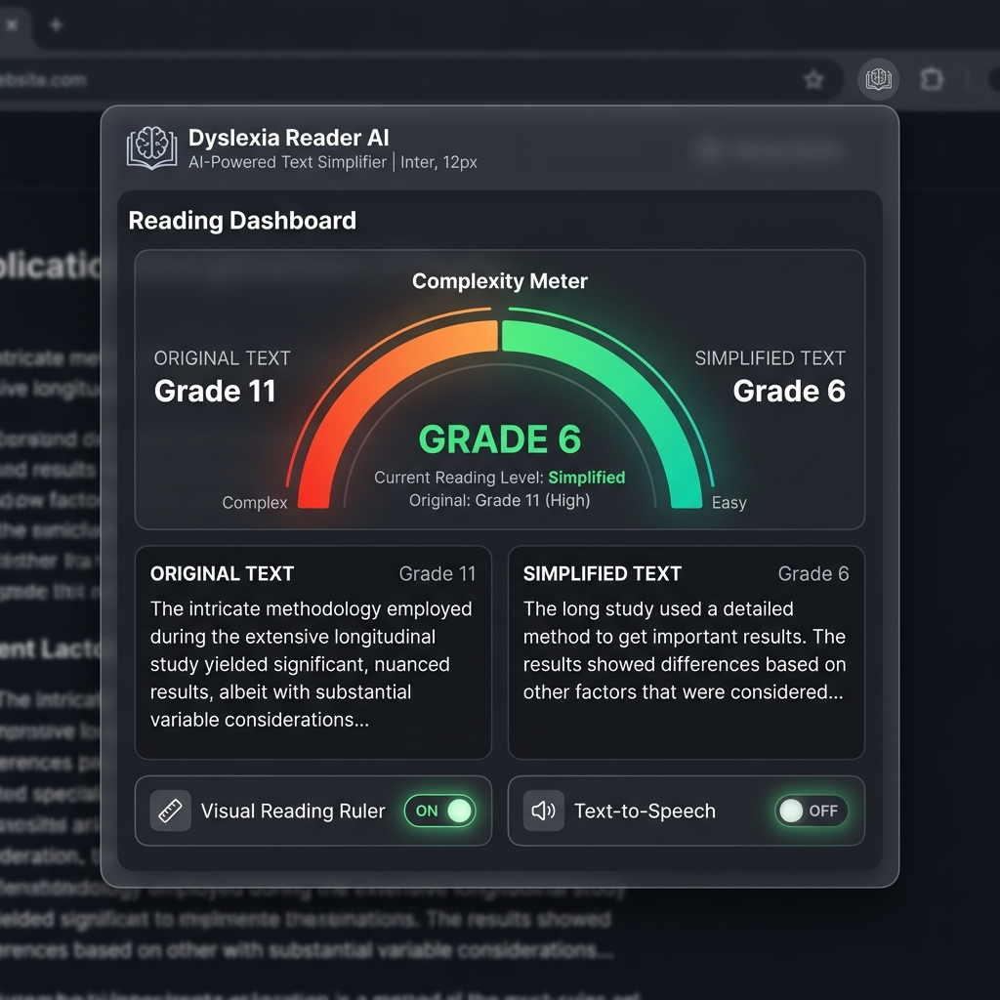
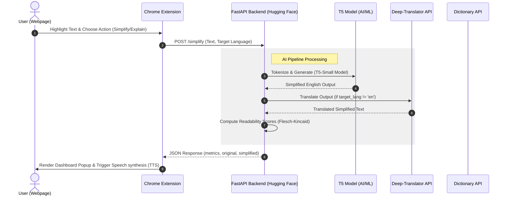

# 🧠 Dyslexia Reader AI

**A Cognitive Accessibility Tool Combining Transformers, Real-Time Readability Metrics, and Multilingual Speech Synthesis.**

---

## 📖 Introduction & Problem Statement

Reading is one of the most fundamental ways we acquire information, yet for individuals with **Dyslexia** and other cognitive reading variances, it can be a challenging, fatiguing, and slow process. Dyslexia affects how the brain processes written language, often leading to:
- **Visual Crowding:** Letters and words appearing too close together, leading to text line skipping.
- **Decoding Fatigue:** Processing long, syntactically complex sentences requires extra cognitive load.
- **Vocabulary Barriers:** Encountering academic or advanced vocabulary can stall reading momentum.

**Dyslexia Reader AI** is a professional-grade browser extension and backend API designed to mitigate these barriers. It integrates **natural language processing (NLP)**, **computer vision rules**, and **speech synthesis** to restructure, simplify, and vocalize web content in real-time, restoring reading independence.

---

## 📸 Extension Preview



---

## 🚀 Core Features

### 1. ✨ Smart Text Simplification
Powered by a fine-tuned **T5 (Text-to-Text Transfer Transformer)** model, the application takes complex, long sentences and rewrites them into simpler syntax while preserving the original core semantic meaning.

### 2. 📊 Reading Complexity Dashboard
Calculates and visualizes the reading difficulty of the text. It computes the readability metrics before and after simplification, showing users a **"Percentage Difficulty Reduction"** (e.g., *40% Easier*) to gamify and track comprehension accessibility.

### 3. 🗣️ AI Voice Tutor
Translates and vocalizes selected text in multiple languages (English, Tamil, Hindi, French, Spanish, German). The integrated Text-to-Speech (TTS) system allows readers to listen to simple explanations, reinforcing auditory learning.

### 4. 📏 Visual Reading Aids
- **Reading Ruler:** A tracking guide that moves with the cursor to prevent line-skipping and visual drift.
- **OpenDyslexic Font:** A specialized typeface designed to increase contrast and prevent letter rotation/flipping.

### 5. 📖 Instant Dictionary
Double-clicking any word triggers an on-the-fly request to a dictionary database, displaying simple definitions instantly without leaving the page.

---

## ⚙️ System Architecture

The project is structured into a decoupling model: a lightweight Chrome Extension frontend and a high-performance Python FastAPI server.



---

## 📊 Readability Metrics & Math

The complexity metrics are calculated using a custom implementation of the **Flesch-Kincaid Grade Level Formula**. The score approximates the U.S. school grade level required to comprehend the text.

The grade level score $S$ is computed as:

$$S = 0.39 \times \left( \frac{\text{Total Words}}{\text{Total Sentences}} \right) + 11.8 \times \left( \frac{\text{Total Syllables}}{\text{Total Words}} \right) - 15.59$$

### Heuristic Logic
1. **Sentence Splitting:** Splitting text by sentence terminators (`.`, `!`, `?`).
2. **Syllable Counting:** A heuristic vowel-transition algorithm that scans characters and accounts for trailing silent vowels (e.g., words ending in `"e"`).
3. **Difficulty Percentage Reduction:** Calculated as:
   $$\text{Reduction (\%)} = \max\left(0, \frac{\text{Original Score} - \text{Simplified Score}}{\text{Original Score}} \times 100\right)$$

---

## 🛠️ Technical Stack

- **Frontend:** HTML5, CSS3 (Custom Glassmorphism styling), JavaScript (Chrome Extension Manifest V3)
- **Backend:** FastAPI, Python 3.9+, Uvicorn
- **AI/ML Layer:** PyTorch, Hugging Face Transformers (`t5-small`), tokenizers
- **Translation:** `deep-translator` library (Google Translate API interface)
- **Containerization:** Docker (Multi-stage builds)

---

## 📄 API References

### 1. Simplify Text
- **Endpoint:** `POST /simplify`
- **Request Body:**
  ```json
  {
    "text": "The implementation of distributed systems requires careful orchestration of database state consensus.",
    "target_lang": "es"
  }
  ```
- **Response Body:**
  ```json
  {
    "original": "The implementation of distributed systems requires careful orchestration of database state consensus.",
    "simplified": "El diseño de sistemas distribuidos requiere mantener de forma sincronizada el estado de la base de datos.",
    "metrics": {
      "original_grade": 12.4,
      "new_grade": 7.2,
      "reduction": 42.0
    }
  }
  ```

### 2. AI Tutor Explanation
- **Endpoint:** `POST /explain`
- **Request Body:**
  ```json
  {
    "text": "Quantum entanglement is a physical phenomenon that occurs when a pair of particles generate in a way such that the quantum state of each particle cannot be described independently of the state of the others.",
    "target_lang": "en"
  }
  ```
- **Response Body:**
  ```json
  {
    "original": "Quantum entanglement...",
    "explanation": "Quantum entanglement happens when two particles are connected so tightly that actions performed on one affect the other, even when separated by large distances.",
    "lang": "en"
  }
  ```

---

## ⚙️ Installation & Developer Guide

### Prerequisites
- Google Chrome browser (or Chromium-based alternative)
- Python 3.9 or higher (if running the server locally)
- Docker (optional)

### Setup Chrome Extension
1. Clone this repository or download the source code:
   ```bash
   git clone https://github.com/adharsh2006/Dyslexia-Reader-AI.git
   ```
2. Open Chrome and navigate to `chrome://extensions/`.
3. Enable **Developer Mode** by toggling the switch in the top-right corner.
4. Click **Load Unpacked** in the top-left corner.
5. Select the `extension` subdirectory within the cloned repository.

---

### Local Server Setup

1. Navigate to the `Server` directory:
   ```bash
   cd Server
   ```
2. Create and activate a Python virtual environment:
   ```bash
   python -m venv venv
   # On Windows:
   .\venv\Scripts\activate
   # On macOS/Linux:
   source venv/bin/activate
   ```
3. Install required libraries:
   ```bash
   pip install -r requirements.txt
   ```
4. Run the FastAPI development server:
   ```bash
   uvicorn app:app --reload --host 127.0.0.1 --port 8000
   ```
5. Update `BASE_URL` in `extension/content.js` to point to `http://127.0.0.1:8000`.

---

### Docker Deployment

To build and run the FastAPI backend using Docker:

1. Build the Docker image:
   ```bash
   docker build -t dyslexia-ai-server ./Server
   ```
2. Run the container:
   ```bash
   docker run -d -p 8000:8000 dyslexia-ai-server
   ```

---

## ✍️ Author

* **Guruprsanna**

---

## 📄 License

This project is open-source and licensed under the **MIT License**. Refer to the LICENSE file for details.
